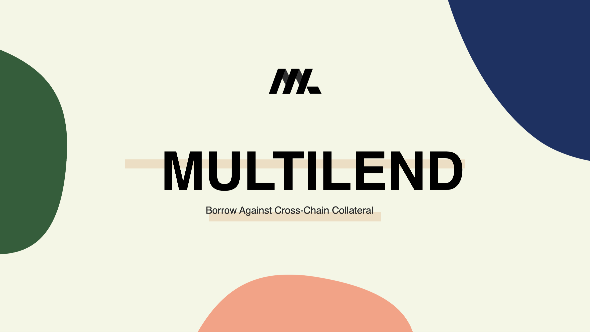

# Watch our Demo

[](https://youtube.com/watch?v=t56QJpncsL0)

## Bounties used: 
* Mantle (https://x.com/atsetsoffc/status/1698197678771900890?s=46&t=KbBIS0seKRXdjHiuINn3zA)
* Celo
* Chronicle Protocol

# MultiLend

## Deposit collateral and take out debt freely across any chain.

## Inspiration
The inspiration for MultiLend came from the growing need for interoperability in the blockchain space. We noticed the limitations of single-chain lending protocols and sought to bridge these gaps by enabling users to deposit collateral on one blockchain and borrow against it on another, thereby unlocking new possibilities for lending.

## What it does
MultiLend is a groundbreaking cross-chain lending protocol that allows users to seamlessly deposit assets as collateral on one blockchain while gaining the ability to access borrowed funds on a different chain. 

## How we built it
Our technology stack for MultiLend includes Next.js with TypeScript and Tailwind CSS. We integrated Mantle, Celo, and Chronicle as bounties to enhance functionality and interoperability. In addition, we utilised ethers and Truffle for smart contract development, ensuring the robustness of our protocol.

## Challenges we ran into
Our primary challenge revolved around designing a scalable and decentralised architecture for cross-chain communication. Overcoming this challenge required significant effort and time. We meticulously crafted an architecture that enables seamless interaction between different blockchains while maintaining decentralisation principles.

## Accomplishments that we're proud of
One of our most significant achievements is the creation of a cross-chain communication layer that transmits information from one blockchain to another through function calls, bridging the gap between disparate blockchain ecosystems.

## What we learned
Participating in this hackathon provided us with invaluable insights into cross-chain interoperability, lending protocol intricacies, and the complexities of liquidations in the DeFi space. We absorbed a wealth of knowledge and experience that will guide our future developments.

## What's next for MultiLend
Our journey with MultiLend is far from over. Moving forward, we plan to continue the development of our protocol, with a focus on refining and optimising our smart contracts. Given more time, we aim to make a substantial impact in the DeFi space by providing users with enhanced cross-chain lending capabilities and further contributing to the growth of decentralised lending.

## Prerequisities

```shell
npm or yarn
node v18 >=
```

### Installing dependencies

```
$ npm i
$ cd app
$ npm i
```

## Deploy on Vercel

The easiest way to deploy your Next.js app is to use the [Vercel Platform](https://vercel.com/new) from the creators of Next.js.

Check out the [Next.js deployment documentation](https://nextjs.org/docs/deployment) for more details.